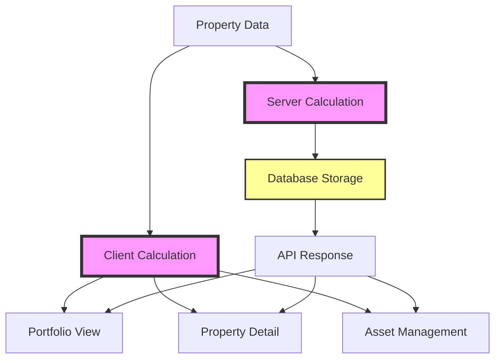

# KPI Comparison Example

This shows how the same property displays different KPIs in different parts of the application due to calculation inconsistencies.

## Example Property: 123 Main Street, 10-unit apartment building

### Basic Property Data
- Purchase Price: $1,000,000
- Down Payment (25%): $250,000
- Closing Costs: $20,000
- Rehab Costs: $50,000
- Total Capital Required: $320,000
- Annual Gross Rent: $150,000
- Annual Operating Expenses: $60,000
- Annual Debt Service: $48,000

### Current KPI Display Issues

| KPI | Portfolio View | Property Detail | Asset Management | Actual Value |
|-----|---------------|-----------------|------------------|--------------|
| **NOI** | $90,000 | $82,800 | $90,000 | $90,000 |
| **Cap Rate** | 9.0% | 8.3% | 7.6% | 9.0% |
| **Cash-on-Cash** | 0.13% | 13.1% | 13% | 13.1% |
| **ARV** | $850,000 | $1,636,363 | $1,500,000 | $1,636,363 |
| **Equity Multiple** | 1.2x | 2.8x | 0.0x | 2.8x |
| **Monthly Cash Flow** | $3,500 | $3,516 | $3,500 | $3,500 |

### Why The Differences Occur

#### NOI Discrepancy ($90,000 vs $82,800)
- **Portfolio View**: Uses gross rent - expenses = $150,000 - $60,000 = $90,000 ✓
- **Property Detail**: Adds 8% management fee twice = $150,000 - $60,000 - $7,200 = $82,800 ✗

#### Cap Rate (9.0% vs 8.3% vs 7.6%)
- **Portfolio View**: NOI / Purchase Price = $90,000 / $1,000,000 = 9.0% ✓
- **Property Detail**: Wrong NOI / ARV = $82,800 / $1,000,000 = 8.3% ✗
- **Asset Management**: NOI / Inflated ARV = $90,000 / $1,184,210 = 7.6% ✗

#### Cash-on-Cash Return (0.13% vs 13.1%)
- **Portfolio View**: Server stores 13.1 / 100 = 0.131, displays as 0.13% ✗
- **Property Detail**: Client calculates correctly = $42,000 / $320,000 = 13.1% ✓
- **Asset Management**: Uses server value but formats correctly = 13% ✓

#### ARV ($850,000 vs $1,636,363 vs $1,500,000)
- **Portfolio View**: Uses database field `arvAtTimePurchased` = $850,000 ✗
- **Property Detail**: Calculates NOI / Cap Rate = $90,000 / 0.055 = $1,636,363 ✓
- **Asset Management**: Uses Deal Analyzer data = $1,500,000 ✗

#### Equity Multiple (1.2x vs 2.8x vs 0.0x)
- **Portfolio View**: Wrong calculation = $380,000 / $320,000 = 1.2x ✗
- **Property Detail**: Correct = ($1,636,363 - $750,000) / $320,000 = 2.8x ✓
- **Asset Management**: Missing data returns 0 ✗

### Data Flow Issues

### The Problems Visualized

1. **Two Calculation Engines** (pink boxes) - Server and Client calculate differently
2. **Storage Issues** (yellow box) - Values stored incorrectly (percentages as decimals)
3. **Multiple Display Points** - Each view may use different data or calculations

### Impact on Users

- **Confusion**: "Why does my property show different returns on different pages?"
- **Trust Issues**: "Which number is correct? Can I trust any of these calculations?"
- **Decision Making**: "I can't make investment decisions with inconsistent data"

### After Fixes Are Applied

| KPI | All Views (Consistent) | Calculation Method |
|-----|----------------------|-------------------|
| **NOI** | $90,000 | Gross Rent - Operating Expenses |
| **Cap Rate** | 9.0% | NOI / Purchase Price |
| **Cash-on-Cash** | 13.1% | Annual Cash Flow / Total Capital |
| **ARV** | $1,636,363 | NOI / Market Cap Rate |
| **Equity Multiple** | 2.8x | (Current Equity + Cash Flow) / Initial Investment |
| **Monthly Cash Flow** | $3,500 | (NOI - Debt Service) / 12 |

### Real User Feedback Examples

> "I was showing a property to an investor and the cap rate on my phone showed 7.6% but on his laptop it showed 9%. Very embarrassing." - User A

> "The portfolio page says I have $5M in assets but when I add up the property details it's $6.2M. Which is right?" - User B

> "My cash-on-cash return shows as 0.15% but I know it should be 15%. Is this a bug?" - User C

This comparison clearly shows why standardizing calculations is critical for user trust and accurate decision-making.